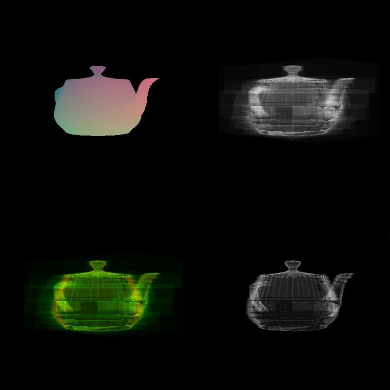

# Acceleration-Structures

This project compares between multiple BVH subdivision heuristics. It implements
a very basic ray tracing, with no bounces beyond the first. For any given
render, the project creates 4 textures that can be selected between:

 * The first is the scene rendered as is, with the models colored based on the
coordinates of the point where the given ray from the camera hits them. 
 * The second is a grayscale render, where every pixel is colored in accordance
with how many intersection tests (with triangles) the ray cast through that
pixel had to do to complete the render. The blackest pixel corresponds to
the minimum amount of intersections, and the whitest pixel corresponds
to the maximum amount of intersections.
 * The third is a grayscale render where every pixel is colored in accordance
with how many traversal steps through the BVH structure the ray cast
through that pixel had to do to complete the render. The blackest pixel
corresponds to the minimum amount of traversal steps, and the whitest
pixel corresponds to the maximum amount of traversal steps.
 * The fourth is a colored image combining the previously mentioned two
measures, the intersection measures are shown in the red channel, and the
traversal steps are shown in the green channel of any given pixel.

The comparisons are made on three different scenes, the first one is a simple Utah teapot, roughly centered on the origin, this scene has roughly 6k primitives. The second scene (**LOA**)contains 216 spheres arranmged in a 6x6x6 grid with 60 faces each. This scene has roughly 13k primitives. The final scene (**HOA**) it also contains spheres like the second scene, however there is also a sphere chopped in half which is big enough to always obstruct a large percentage of the view. This scene also has roughly 13k primitives.

The five BVH heuristics compared are:
 * naive
 * Surface Area Heuristic
 * Ray Distribution Heuristic based on [this paper](https://dl.acm.org/doi/10.1145/1980462.1980475)
 * Ray Distribution Heuristic blended with Surface Area Heuristic
 * Occlusion Heuristic based on [this paper](https://www.sciencedirect.com/science/article/abs/pii/S0097849312000362)

The full report can be found [here](report/Report.pdf).